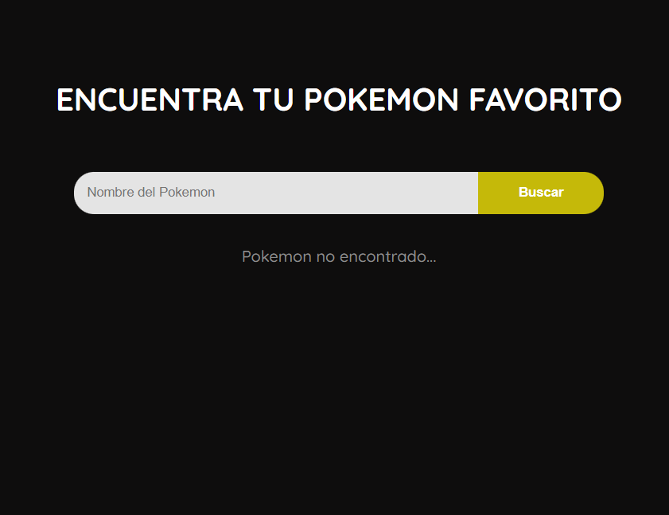
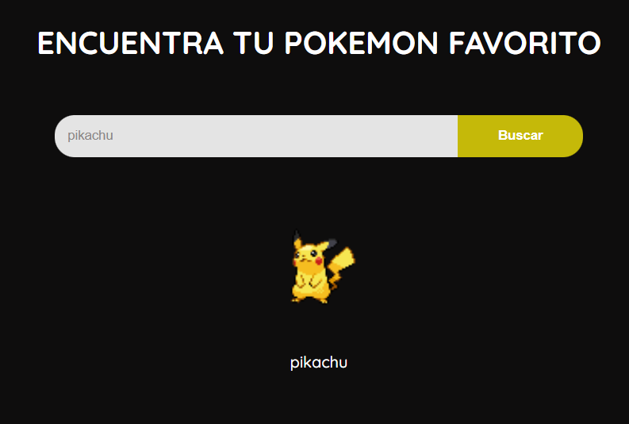
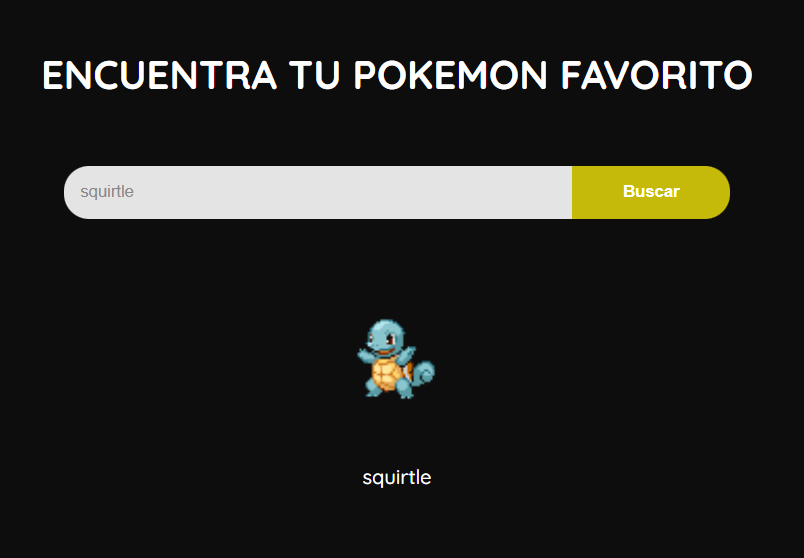

# Buscador de pokemons en React (Proyecto de 2021) v1.0.0
## Descripción del proyecto

Este proyecto radica en un buscador de pokemons, el cual
cuenta con un input para ingresar el nombre y en caso de 
encontrarlo mostrará una imagen representativa del personaje.
Este fue realizado en el 2021, se sube con fines ilustrativos.

## Imagenes

Vista principal de busqueda de pokemnos

Vista de resultado

Vista de resultado 2 (puede mostrar infinidad de los pokemons que contenga la API)

## Para más información

Documentación de la API Pokemons: https://pokeapi.co/

